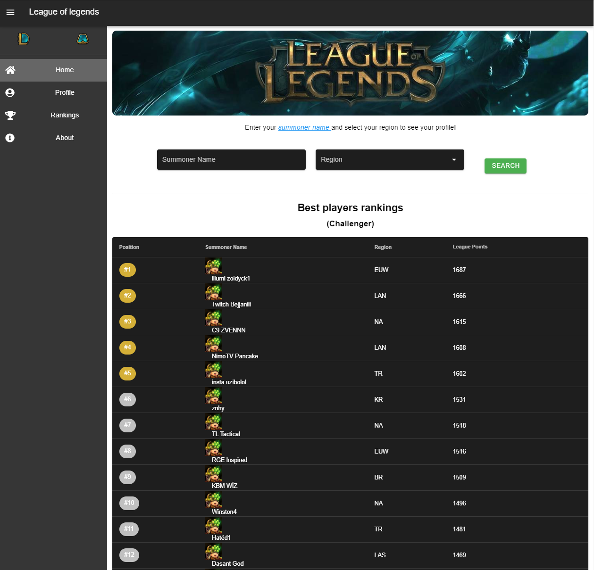

# League of Legends App



## Tabla de contenidos
* [Información General](#Informacion-general)
* [Tecnologías](#Tecnologias)
* [Project setup](#Project-setup)

## Información General
Esta aplicación es un proyecto con el único fin de practicar con tecnologías
de FrontEnd. La aplicación hace uso de la [Api de RIOT](https://developer.riotgames.com)

La idea general de la aplicación es; mostrar y buscar información de los jugadores que se soliciten en cualquiera de los 11 servidores que se quiera buscar, al igual que conocer los mejores jugadores a nivel mundial en cualquiera de los dos juegos de RIOT, league of legends o team fight tactics.

## Tecnologías
* HTML5
* CSS3
  * Stylus
* Javascript
  * Vuejs
    * Vuetify (responsive components)
* Npm
  * Axios

## Project setup

La [Api de RIOT](https://developer.riotgames.com) no se puede consumir de forma normal por sus [CORS Policy](https://www.codecademy.com/articles/what-is-cors), esto es para asegurar el correcto uso de su información, existen varias maneras de solucionar este inconveniente, pero como este proyecto es únicamente para practicar tecnologías de FrontEnd lo que haremos es desactivar la seguridad de nuestro navegador, en este caso Chrome.

Para windows:
```
"C:\Program Files (x86)\Google\Chrome\Application\chrome.exe" --disable-web-security --user-data-dir="D:\chrome"
```
En linux (Ubuntu):
```
google-chrome  --user-data-dir=”/var/tmp/Chrome” --disable-web-security
```
La rutas escritas anteriormente son las más comunes pero puedes adaptarlas a la configuración de tu OS.

IMPORTANTE! Debes conocer los riesgos de hacer el proceso de desactivar la seguridad del navegador, recomiendo hacerlo solo para visualizar la aplicación.
[Riesgos de seguridad](https://games.greggman.com/game/dont-disable-web-security/)

Descarga, instala y corre el proyecto:
```
npm install
npm run serve
```
Una vez instaladas las dependencias solo queda que generes tu API_KEY que te otorga RIOT [aquí](https://developer.riotgames.com) y la pegues en la siguiente ruta:
```
src/utils/ApiData.js
```

### Compiles and minifies for production
```
npm run build
```
### Run your unit tests
```
npm run test:unit
```
### Run your end-to-end tests
```
npm run test:e2e
```
### Lints and fixes files
```
npm run lint
```